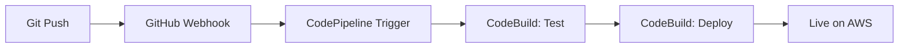

# Vaske Media Processor - CI/CD Pipeline

## 🎯 **GitHub Integration - Automatic Deployment!**

This CI/CD pipeline integrates directly with GitHub and automatically triggers deployment when you push to the main branch. No manual uploads or triggers needed!

## 🚀 **How It Works**

1. **GitHub Source**: Pipeline monitors your GitHub repository  
2. **Automatic Trigger**: Deploys automatically on push to main branch
3. **Inline Buildspecs**: All build instructions are embedded in CDK code
4. **Complete Automation**: Push code → Tests run → Deploy to AWS

## 📋 **Quick Start**

### **Step 1: Create GitHub Personal Access Token**
1. Go to GitHub → Settings → Developer settings → Personal access tokens
2. Create a new token with these permissions:
   - `repo` (Full control of private repositories)
   - `admin:repo_hook` (Read and write repository hooks)
3. Copy the token (you'll need it for setup)

### **Step 2: Setup GitHub Integration**
```powershell
cd CI-CD/Pipeline

# Run the setup script (replace with your values)
.\setup-github-integration.ps1 -GitHubToken "ghp_your_token_here" -GitHubOwner "your-username" -GitHubRepo "aws-upskilling-vaske"
```

### **Step 3: Deploy Pipeline Infrastructure**
```bash
# Build and deploy the pipeline
dotnet build
cdk deploy VaskeMediaProcessor-Pipeline --require-approval never
```

### **Step 4: Push Code to Trigger Deployment**
```bash
# Push your code to main branch
git add .
git commit -m "Enable CI/CD pipeline"
git push origin main
```

**🎉 That's it! The pipeline will automatically deploy your application!**

## 🔧 **Pipeline Components**

### **Main CI/CD Pipeline: `VaskeMediaProcessor-CICD`**
- **Source**: GitHub repository (automatic webhook)
- **TestAndBuild**: Unit tests + Lambda publishing  
- **Deploy**: CDK deployment to AWS
- **Trigger**: Automatic on push to main branch

### **Destroy Pipeline: `VaskeMediaProcessor-Destroy`** 
- **Source**: GitHub repository (manual trigger only)
- **Destroy**: Complete infrastructure cleanup
- **Trigger**: Manual (for safety)

## 📊 **Pipeline Workflow**



## 🛠 **Operations**

### **Automatic Deployment**
```bash
# Just push to main - that's it!
git add .
git commit -m "Update application"
git push origin main
```

### **Manual Destroy (via AWS Console)**
1. Go to CodePipeline console
2. Find `VaskeMediaProcessor-Destroy` pipeline
3. Click "Release change" to trigger destruction

### **Check Pipeline Status**
```bash
# View in AWS Console
https://eu-north-1.console.aws.amazon.com/codesuite/codepipeline/pipelines/VaskeMediaProcessor-CICD/view
```

### **Direct Deployment (Bypass Pipeline)**
```bash
cd ../../Infrastructure
cdk deploy VaskeMediaProcessor-App --require-approval never
```

### **Emergency Destroy (Direct)**
```bash
cd ../../Infrastructure
cdk destroy VaskeMediaProcessor-App --force
```

## 📁 **What Gets Deployed**

The pipeline automatically processes:
- ✅ `LambdaHandlers/` - Lambda functions (.NET 8)
- ✅ `Infrastructure/` - CDK infrastructure code
- ✅ `LambdaHandlers.Tests/` - Unit tests (must pass!)
- ✅ All project files from GitHub repository

**Automatically excluded by .gitignore:**
- ❌ `bin/`, `obj/` folders
- ❌ `.vs/`, `node_modules/`
- ❌ `cdk.out/`, temp files

## 🔐 **IAM Permissions**

The pipeline creates these resources:
- **CodePipeline**: `VaskeMediaProcessor-CICD` & `VaskeMediaProcessor-Destroy`
- **CodeBuild Projects**: Test, Deploy, and Destroy
- **S3 Artifacts Bucket**: `vaske-pipeline-artifacts-*`
- **CloudWatch Log Groups**: Build logs with 1-week retention

## 🎯 **Benefits**

✅ **Automatic GitHub integration**
✅ **Zero-touch deployment** - just push to main!
✅ **Immediate feedback** via GitHub commit status  
✅ **Version controlled buildspecs** (inline in CDK)
✅ **Professional CI/CD workflow**
✅ **Easy collaboration** - team members just push code

## 🔗 **Pipeline URLs (After Deployment)**

- **Main Pipeline**: `https://eu-north-1.console.aws.amazon.com/codesuite/codepipeline/pipelines/VaskeMediaProcessor-CICD/view`
- **Destroy Pipeline**: `https://eu-north-1.console.aws.amazon.com/codesuite/codepipeline/pipelines/VaskeMediaProcessor-Destroy/view`

## 🔐 **GitHub Token Permissions Required**

Your GitHub Personal Access Token needs:
- ✅ `repo` - Full control of repositories
- ✅ `admin:repo_hook` - Manage repository webhooks

## 🚀 **Ready to Go!**

1. **Setup**: `.\setup-github-integration.ps1 -GitHubToken "your_token" -GitHubOwner "username" -GitHubRepo "repo"`
2. **Deploy**: `cdk deploy VaskeMediaProcessor-Pipeline --require-approval never`
3. **Push code**: `git push origin main` 
4. **Watch magic happen!** 🎉

**Professional GitHub CI/CD - push to deploy!** 🚀